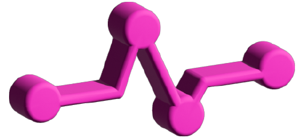

<!-- PROJECT SHIELDS -->
<!--
*** I'm using markdown "reference style" links for readability.
*** Reference links are enclosed in brackets [ ] instead of parentheses ( ).
*** See the bottom of this document for the declaration of the reference variables
*** for contributors-url, forks-url, etc. This is an optional, concise syntax you may use.
*** https://www.markdownguide.org/basic-syntax/#reference-style-links
-->

[![Contributors][contributors-shield]][contributors-url]
[![Forks][forks-shield]][forks-url]
[![Stargazers][stars-shield]][stars-url]
[![Issues][issues-shield]][issues-url]
[![MIT License][license-shield]][license-url]

<!-- PROJECT LOGO -->
 

  

  <h2 align="center">Graph Pulse</h2>

  

    An tool to monitor GraphQL performance
     
    <a href="https://github.com/open-source-labs/GraphPulse"><strong>Explore the code & contribute here </strong></a>
     
     
    <a href="https://github.com/open-source-labs/GraphPulse/#about-the-project">View Demo</a>
    ·
    <a href="https://github.com/open-source-labs/GraphPulse/issues">Report Bug</a>
    ·
    <a href="https://github.com/open-source-labs/GraphPulse">Request Feature</a>
  

<!-- TABLE OF CONTENTS -->

  
Table of Contents

  <ol>
    <li><a href="#about-the-project">About The Project</a></li>
    <li><a href="#getting-started">Getting Started</a></li>
    <li><a href="#open-issues">Open issues</a></li>
    <li><a href="#contributing">Contributing</a></li>
    <li><a href="#authors">Authors</a></li>
    <li><a href="#license">License</a></li>
  </ol>

<!-- ABOUT THE PROJECT -->
## About The Project

            
[![!JavaScript][JavaScript]][JavaScript-url]
[![Node][Node.js]][Node-url]
[![Express][Express]][Express-url]
[![React][React.js]][React-url]
[![React-Router][React-Router]][ReactRouter-url]
[![React-Flow][React-Flow]][ReactFlow-url]
[![Monaco-Editor][Monaco-editor]][Monaco-editor-url]
[![Apollo-server][Apollo-server]][Apollo-server-url]
[![GraphQL][GraphQL]][GraphQl-url]
[![Postgres][Postgres]][Postgres-url]
[![MySQL][MySQL]][MySQL-url]
[![Webpack][Webpack]][Webpack-url]
[![Git][Git]][Git-url]
[![HTML5][HTML5]][HTML5-url]
[![CSS3][CSS3]][CSS3-url]

Graph Pulse is a application designed to tackle the challenges associated with GraphQL by offering a robust solution for monitoring performance metrics. This product aims to empower developers to optimize queries and enhance the overall performance of their GraphQL APIs.

(<a href="#readme-top">back to top</a>)

<!-- GETTING STARTED -->
## Getting Started

 
  

    
  

 

Getting started with GraphPulse is a straightforward process. Users have two options: they can either use GraphPulse with a guest account or register for a personalized experience. Upon authentication, whether through a guest account or a registered one, users can begin running their GraphQL queries. The visualization feature can be accessed through the user-friendly interface, providing a clear overview of the query structure. This visual representation aids developers in identifying patterns, dependencies, and potential areas for improvement.

<!-- OPEN ISSUES -->
## Open issues

See the [open issues](https://github.com/open-source-labs/GraphPulse/issues) for a full list of proposed features (and known issues).

(<a href="#readme-top">back to top</a>)

<!-- CONTRIBUTING -->
## Contributing

Graph Pulse is an open-source project, and contributions from the community are welcomed. If you're interested in contributing to Graph Pulse, fork the repository, open an issue describing your contribution (open an issue with the tag "enhancement"), and submit a pull request. Your contributions will be reviewed and merged to benefit the entire community. Don't forget to give the project a star ⭐️ ! 

1. Fork the repository
2. Create your Feature Branch (`git checkout -b feature/yourFeature`)
3. Commit your Changes (`git commit -m 'Add  yourFeature'`)
4. Push to the Branch (`git push origin feature/yourFeature`)
5. Open a Pull Request

(<a href="#readme-top">back to top</a>)

<!-- AUTHORS -->
## Authors

  - Jerel Cruz [Github](https://github.com/jaycruz2905) | [LinkedIn](https://www.linkedin.com/in/jerel-cruz/)
 - Binetou Maggio [Github](https://github.com/bimaggio) |[LinkedIn](https://www.linkedin.com/in/binetou-maggio)
 - Daniel Song - [Github](https://github.com/djsong15) | [LinkedIn](https://www.linkedin.com/in/danieljsong/)
-  David Tskhvedadze - [Github](https://github.com/davidtskhvedadze) | [LinkedIn](Link)

(<a href="#readme-top">back to top</a>)

<!-- LICENSE -->
## License

Distributed under the MIT License. See `LICENSE.txt` for more information.

(<a href="#readme-top">back to top</a>)

<!-- MARKDOWN LINKS & IMAGES -->
<!-- https://www.markdownguide.org/basic-syntax/#reference-style-links -->
[contributors-shield]: https://img.shields.io/github/contributors/open-source-labs/GraphPulse.svg?style=for-the-badge
[contributors-url]: https://github.com/open-source-labs/GraphPulse/graphs/contributors
[forks-shield]: https://img.shields.io/github/forks/open-source-labs/GraphPulse.svg?style=for-the-badge
[forks-url]: https://github.com/open-source-labs/GraphPulse/network/members
[stars-shield]: https://img.shields.io/github/stars/open-source-labs/GraphPulse.svg?style=for-the-badge
[stars-url]: https://github.com/open-source-labs/GraphPulse/stargazers
[issues-shield]: https://img.shields.io/github/issues/open-source-labs/GraphPulse.svg?style=for-the-badge
[issues-url]: https://github.com/open-source-labs/GraphPulse/issues
[license-shield]: https://img.shields.io/github/license/open-source-labs/GraphPulse.svg?style=for-the-badge
[license-url]: https://github.com/opens-source-labs/GraphPulse/blob/master/LICENSE.txt
[React.js]: https://img.shields.io/badge/React-20232A?style=for-the-badge&logo=react&logoColor=61DAFB
[React-url]: https://reactjs.org/
[Bootstrap.com]: https://img.shields.io/badge/Bootstrap-563D7C?style=for-the-badge&logo=bootstrap&logoColor=white
[Bootstrap-url]: https://getbootstrap.com
[JQuery.com]: https://img.shields.io/badge/jQuery-0769AD?style=for-the-badge&logo=jquery&logoColor=white
[JQuery-url]: https://jquery.com 
[JavaScript]: https://img.shields.io/badge/javascript-%23323330.svg?style=for-the-badge&logo=javascript&logoColor=%23F7DF1E
[JavaScript-url]: https://www.javascript.com/
[Node.js]: https://img.shields.io/badge/node.js-6DA55F?style=for-the-badge&logo=node.js&logoColor=white
[Node-url]: https://nodejs.org/en/
[Express]: https://img.shields.io/badge/express.js-%23404d59.svg?style=for-the-badge&logo=express&logoColor=%2361DAFB
[Express-url]: https://expressjs.com/
[Postgres]: https://img.shields.io/badge/postgres-%23316192.svg?style=for-the-badge&logo=postgresql&logoColor=white
[Postgres-url]: https://img.shields.io/badge/postgres-%23316192.svg?style=for-the-badge&logo=postgresql&logoColor=white](https://www.postgresql.org/)
[Git]: https://img.shields.io/badge/git-%23F05033.svg?style=for-the-badge&logo=git&logoColor=white
[Git-url]: https://git-scm.com/
[CSS3]: https://img.shields.io/badge/css3-%231572B6.svg?style=for-the-badge&logo=css3&logoColor=white
[CSS3-url]: https://www.w3schools.com/css/
[HTML5]: https://img.shields.io/badge/html5-%23E34F26.svg?style=for-the-badge&logo=html5&logoColor=white
[HTML5-url]: https://www.w3schools.com/html/
[MySQL]: https://img.shields.io/badge/mysql-%2300f.svg?style=for-the-badge&logo=mysql&logoColor=white
[MySQL-url]:https://www.mysql.com/
[D3]: https://img.shields.io/badge/d3-red?style=for-the-badge&logo=d3.js
[D3-url]: https://d3js.org
[React-Flow]: https://img.shields.io/badge/React_Flow-42a5f5?style=for-the-badge&logo=react&logoColor=white
[ReactFlow-url]: https://reactflow.dev/
[React-Router]: https://img.shields.io/badge/React_Router-CA4245?style=for-the-badge&logo=react-router&logoColor=white
[ReactRouter-url]: https://reactrouter.com/
[Monaco-Editor]: https://img.shields.io/badge/Monaco_Editor-007ACC?style=for-the-badge&logo=visual-studio-code&logoColor=white
[Monaco-Editor-url]: https://microsoft.github.io/monaco-editor/
[GraphQL]: https://img.shields.io/badge/GraphQL-E10098?style=for-the-badge&logo=graphql&logoColor=white
[GraphQL-url]: https://graphql.org/
[Apollo-server]: https://img.shields.io/badge/Apollo_Server-311C87?style=for-the-badge&logo=apollo&logoColor=white
[Apollo-server-url]: https://www.apollographql.com/docs/apollo-server/
[Webpack]: https://img.shields.io/badge/Webpack-8DD6F9?style=for-the-badge&logo=webpack&logoColor=white
[Webpack-url]: https://webpack.js.org/